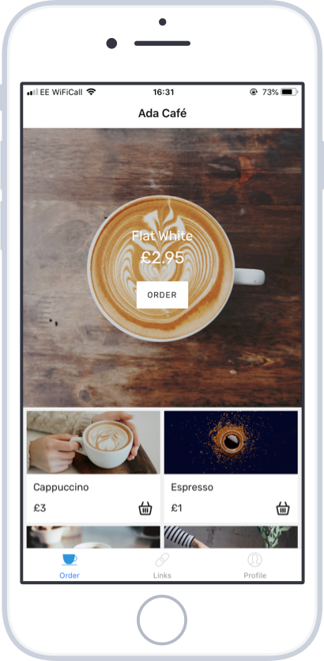

# Ada Cafe App

This code is for a workshop I ran at Flatiron School in London in celebration of Ada Lovelace Day.

It is a beginners intro to app development in React Native workshop.

If you want to be able to follow along, there is a [tutorial on medium](https://medium.com/@angineering/ada-lovelace-day-workshop-part-1-react-native-app-setup-93451bdf9f3b).

## What we made

A react native app for the Ada Cafe that lets users see the list of coffees it has to offer, their price and a beautiful illustrative image.

The purpose of this app for the Ada Cafe would be to let their customers easily order their coffee on the phone.

Clicking a coffee gave visible feedback, like pressing a button. The actual implementation of ordering was left as an exercise to the reader.

